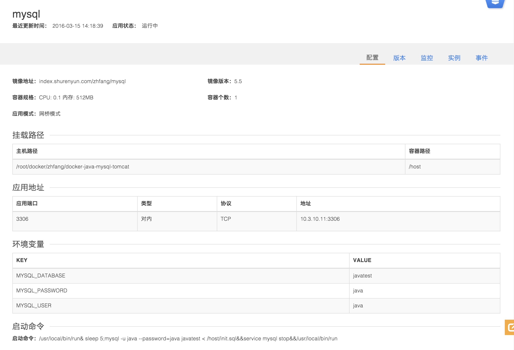

# Docker Java/MySQL Tomcat Sample
This is a simple Java application with MySQL.
##TREE

```
├── Dockerfile                        #tomcat Dockerfile
├── dbtest                            #jsp 文件
│   ├── META-INF
│   │   └── contextbak.xml
│   ├── WEB-INF
│   │   ├── lib
│   │   │   ├── jstl.jar
│   │   │   ├── mysql.jar
│   │   │   └── standard.jar
│   │   └── web.xml
│   └── index.jsp
├── fig.yml
├── init.sql                         ＃数据库初始化sql
├── readme.md
├── replace.jar                      ＃test 的jar包
└── test                             ＃java简单读取环境变量的例子
    ├── bin
    │   └── test
    │       └── ReadWriteFile.class
    └── src
        └── test
            └── ReadWriteFile.java
```
## 流程
####1、用docker启动数据库，并向数据库中插入一条数据；
* `docker run -d --net=host   -v $(pwd):/host -e MYSQL_USER=java -e MYSQL_PASSWORD=java -e MYSQL_DATABASE=javatest --name mysql   index.shurenyun.com/zhfang/mysql:5.5`
* `docker exec -it mysql bash`
* `mysql -u java --password=java  javatest < /host/init.sql`
* `exit`

####2、制作docker镜像
* `docker build -t index.shurenyun.com/zhfang/javatest:0315 .`


####3、制作docker镜像，java先通过读取环境变量，得到mysql的参数，从而tomcat访问数据库
* `docker run --net=host -e MYSQL_USER=java -e MYSQL_PASSWORD=java -e MYSQL_DATABASE=javatest -e MYSQL_HOST=10.3.10.11 index.shurenyun.com/zhfang/javatest:0315  bash -c "java -jar /tmp/replace.jar&&/usr/local/bin/run"`

####4、访问
You should be able to access the app on http://\<docker-host-ip\>:8080/dbtest


## 数人云发布
###mysql 发布

#####*应用名称:mysql
#####*选择集群:java-demo
#####*镜像地址:index.shurenyun.com/zhfang/mysql
#####*镜像版本:5.5
#####*网络模式:网桥模式  
#####*挂载点添加挂载路径
主机路径:/root/docker/zhfang/docker-java-mysql-tomcat
容器路径:/host
	
#####*容器规格：CPU: 0.1 内存: 512MB
#####*容器个数:1

####高级设置 
#####应用地址
3306 对内tcp 3306


#####添加环境变量
######MYSQL_DATABASE	javatest
######MYSQL_PASSWORD	java
######MYSQL_USER	java

#####CMD
`/usr/local/bin/run& sleep 5;mysql -u java --password=java javatest < /host/init.sql&&service mysql stop&&/usr/local/bin/run`




